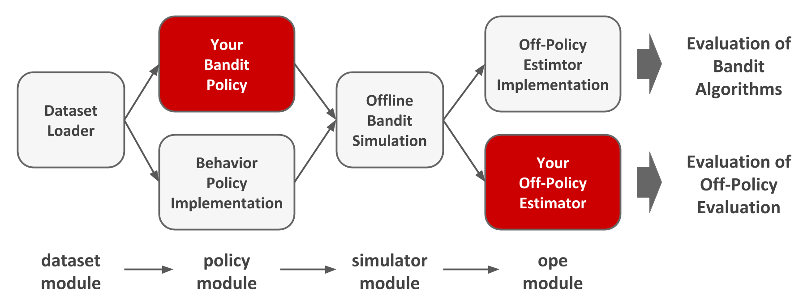
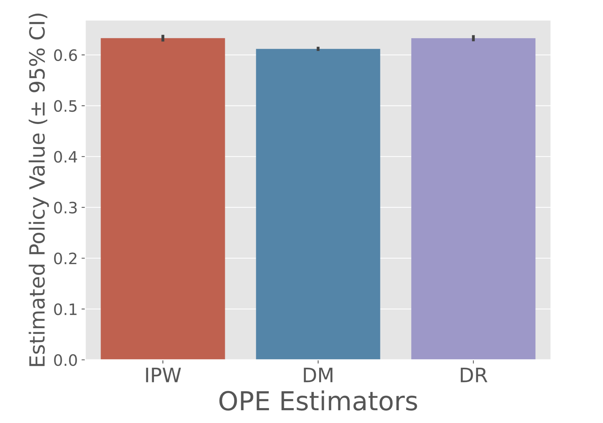

<p align="center">
  
</p>

# Open Bandit Pipeline: a research framework for bandit algorithms and off-policy evaluation

**[Docs](https://zr-obp.readthedocs.io/en/latest/)** | **[Google Group](https://groups.google.com/g/open-bandit-project)** | **[Installation](#installation)** | **[Usage](#usage)** | **[Slides](./slides/slides_EN.pdf)** | **[Quickstart](./examples/quickstart)** | **[Open Bandit Dataset](./obd)** | **[日本語](./README_JN.md)**

<details>
<summary><strong>Table of Contents</strong></summary>

- [Open Bandit Pipeline: a research framework for bandit algorithms and off-policy evaluation](#open-bandit-pipeline-a-research-framework-for-bandit-algorithms-and-off-policy-evaluation)
- [Overview](#overview)
  - [Open Bandit Dataset (OBD)](#open-bandit-dataset-obd)
  - [Open Bandit Pipeline (OBP)](#open-bandit-pipeline-obp)
    - [Algorithms and OPE Estimators Supported](#algorithms-and-ope-estimators-supported)
  - [Topics and Tasks](#topics-and-tasks)
- [Installation](#installation)
- [Usage](#usage)
  - [(1) Data loading and preprocessing](#1-data-loading-and-preprocessing)
  - [(2) Off-Policy Learning](#2-off-policy-learning)
  - [(3) Off-Policy Evaluation](#3-off-policy-evaluation)
- [Citation](#citation)
- [Google Group](#google-group)
- [Contribution](#contribution)
- [License](#license)
- [Project Team](#project-team)
- [Contact](#contact)
- [References](#references)

</details>

# Overview

## Open Bandit Dataset (OBD)

*Open Bandit Dataset* is a public real-world logged bandit feedback dataset.
This dataset is provided by [ZOZO, Inc.](https://corp.zozo.com/en/about/profile/), the largest Japanese fashion e-commerce company with over 5 billion USD market capitalization (as of May 2020).
The company uses some multi-armed bandit algorithms to recommend fashion items to users in a large-scale fashion e-commerce platform called [ZOZOTOWN](https://zozo.jp/).
The following figure presents examples of displayed fashion items as actions.
The figure shows that there are three *positions* in the data.

<p align="center">
  
  <figcaption>
  <p align="center">
  Recommended fashion items as actions in the ZOZOTOWN recommendation interface
  </p>
  </figcaption>
</p>

We collected the dataset in a 7-day experiment in late November 2019 on three “campaigns,” corresponding to all, men's, and women's items, respectively.
Each campaign randomly used either the Uniform Random policy or the Bernoulli Thompson Sampling (Bernoulli TS) policy for the data collection.
This dataset is unique in that it contains a set of *multiple* logged bandit feedback datasets collected by running different policies on the same platform. This enables realistic and reproducible experimental comparisons of different OPE estimators for the first time (see [our documentation](https://zr-obp.readthedocs.io/en/latest/evaluation_ope.html) for the details of the evaluation of OPE protocol with Open Bandit Dataset).

<p align="center">
  
</p>

The small size version of our data is available at [obd](./obd).
One can use this example data to run some [examples](./examples).
We release the full size version of our data at [https://research.zozo.com/data.html](https://research.zozo.com/data.html).
Please download the full size version for research uses.
Please see [obd/README.md](./obd/README.md) for the dataset description.

## Open Bandit Pipeline (OBP)

*Open Bandit Pipeline* is an open-source Python software including a series of modules for implementing dataset preprocessing, policy learning methods, and OPE estimators. Our software provides a complete, standardized experimental procedure for OPE research, ensuring that performance comparisons are fair, transparent, and reproducible. It also enables fast and accurate OPE implementation through a single unified interface, simplifying the practical use of OPE.

<p align="center">
  
  <figcaption>
  <p align="center">
    Overview of the Open Bandit Pipeline
  </p>
  </figcaption>
</p>

Open Bandit Pipeline consists of the following main modules.

- [**dataset module**](./obp/dataset/): This module provides a data loader for Open Bandit Dataset and a flexible interface for handling logged bandit feedback. It also provides tools to generate synthetic bandit data and transform multi-class classification data to bandit data.
- [**policy module**](./obp/policy/): This module provides interfaces for implementing new online and offline bandit policies. It also implements several standard policy learning methods.
- [**simulator module**](./obp/simulator/): This module provides functions for conducting offline bandit simulation. This module is necessary only when we want to implement the ReplayMethod to evaluate the performance of online bandit policies with logged bandit data. Please refer to [examples/quickstart/online.ipynb](./examples/quickstart/online.ipynb) [](https://colab.research.google.com/github/st-tech/zr-obp/blob/master/examples/quickstart/online.ipynb) for the quickstart guide of implementing OPE of online bandit algorithms.
- [**ope module**](./obp/ope/): This module provides interfaces for implementing OPE estimators. It also implements several standard and advanced OPE estimators.

### Supported Bandit Algorithms and OPE Estimators

<details>
<summary><strong>Bandit Algorithms </strong>(click to expand)</summary>
<br>

- Online
  - Non-Contextual (Context-free)
    - Random
    - Epsilon Greedy
    - Bernoulli Thompson Sampling
  - Contextual (Linear)
    - Linear Epsilon Greedy
    - [Linear Thompson Sampling](http://proceedings.mlr.press/v28/agrawal13)
    - [Linear Upper Confidence Bound](https://dl.acm.org/doi/pdf/10.1145/1772690.1772758)
  - Contextual (Logistic)
    - Logistic Epsilon Greedy
    - [Logistic Thompson Sampling](https://papers.nips.cc/paper/4321-an-empirical-evaluation-of-thompson-sampling)
    - [Logistic Upper Confidence Bound](https://dl.acm.org/doi/10.1145/2396761.2396767)
- Offline (Off-Policy Learning)
  - [Inverse Probability Weighting (IPW) Learner](https://arxiv.org/abs/1503.02834)
  - Neural Network-based Policy Learner

</details>

<details>
<summary><strong>OPE Estimators </strong>(click to expand)</summary>
<br>

- OPE of Online Bandit Algorithms
  - [Replay Method (RM)](https://arxiv.org/abs/1003.5956)
- OPE of Offline Bandit Algorithms
  - [Direct Method (DM)](https://arxiv.org/abs/0812.4044)
  - [Inverse Probability Weighting (IPW)](https://scholarworks.umass.edu/cgi/viewcontent.cgi?article=1079&context=cs_faculty_pubs)
  - [Self-Normalized Inverse Probability Weighting (SNIPW)](https://papers.nips.cc/paper/5748-the-self-normalized-estimator-for-counterfactual-learning)
  - [Doubly Robust (DR)](https://arxiv.org/abs/1503.02834)
  - [Switch Estimators](https://arxiv.org/abs/1612.01205)
  - [More Robust Doubly Robust (MRDR)](https://arxiv.org/abs/1802.03493)
  - [Doubly Robust with Optimistic Shrinkage (DRos)](https://arxiv.org/abs/1907.09623)
  - [Double Machine Learning (DML)](https://arxiv.org/abs/2002.08536)
- OPE of Offline Slate Bandit Algorithms
  - [Independent Inverse Propensity Scoring (IIPS)](https://arxiv.org/abs/1804.10488)
  - [Reward Interaction Inverse Propensity Scoring (RIPS)](https://arxiv.org/abs/2007)
- OPE of Offline Bandit Algorithms with Continuous Actions
  - [Kernelized Inverse Probability Weighting](https://arxiv.org/abs/1802.06037)
  - [Kernelized Self-Normalized Inverse Probability Weighting](https://arxiv.org/abs/1802.06037)
  - [Kernelized Doubly Robust](https://arxiv.org/abs/1802.06037)

</details>

Please refer to to our [documentation](https://zr-obp.readthedocs.io/en/latest/ope.html) for the basic formulation of OPE and the definitions of several OPE estimators.
Note that, in addition to the above algorithms and estimators, Open Bandit Pipeline provides flexible interfaces.
Therefore, researchers can easily implement their own algorithms or estimators and evaluate them with our data and pipeline.
Moreover, Open Bandit Pipeline provides an interface for handling real-world logged bandit feedback data.
Thus, practitioners can combine their own real-world data with Open Bandit Pipeline and easily evaluate bandit algorithms' performance in their settings with OPE.


## Topics and Tasks
Currently, Open Bandit Dataset and Pipeline facilitate the following research topics or practical tasks.

### Research

Researchers can evaluate the performance of their bandit algorithms (in bandit papers) or the accuracy of their OPE estimators (in OPE papers) in an easy, standardized manner with Open Bandit Pipeline. One can implement these types of experiments for their research papers using synthetic bandit data, multi-class classification data, or the real-world Open Bandit Dataset.

- **Evaluation of Bandit Algorithms with Synthetic/Classification/Open Bandit Data**
- **Evaluation of OPE with Synthetic/Classification/Open Bandit Data**

In particular, we prepare some example experiments about the evaluation and comparison of OPE estimators in [examples](./examples/). One can learn how to implement the OPE experiments with Open Bandit Pipeline from the examples.

### Practice

Practitioners can improve their automated decision making systems using online/batch bandit policies implemented in the policy module. Moreover, they can easily evaluate such bandit policies using historical logged bandit feedback data and OPE without A/B testing. Specifically, one can implement OPE of batch bandit algorithms with the standard OPE procedure introduced in [examples/quickstart/obd.ipynb](./examples/quickstart/obd.ipynb).

- **Implementing Online/Offline(Batch) Bandit Algorithms**
- **Off-Policy Evaluation of Online Bandit Algorithms**
- **Off-Policy Evaluation of Offline(Batch) Bandit Algorithms**


# Installation

You can install OBP using Python's package manager `pip`.

```
pip install obp
```

You can also install OBP from source.
```bash
git clone https://github.com/st-tech/zr-obp
cd zr-obp
python setup.py install
```

Open Bandit Pipeline supports Python 3.7 or newer.

# Usage Examples

## Example with Synthetic Bandit Data

Here is an example of conducting OPE of the performance of IPWLearner as an evaluation policy using Direct Method (DM), Inverse Probability Weighting (IPW), Doubly Robust (DR) as OPE estimators.

```python
# a case for implementing OPE of the IPWLearner using synthetic bandit data
from sklearn.linear_model import LogisticRegression
# import open bandit pipeline (obp)
from obp.dataset import SyntheticBanditDataset
from obp.policy import IPWLearner
from obp.ope import (
    OffPolicyEvaluation,
    RegressionModel,
    InverseProbabilityWeighting as IPW,
    DirectMethod as DM,
    DoublyRobust as DR,
)

# (1) Generate Synthetic Bandit Data
dataset = SyntheticBanditDataset(n_actions=10, reward_type="binary")
bandit_feedback_train = dataset.obtain_batch_bandit_feedback(n_rounds=1000)
bandit_feedback_test = dataset.obtain_batch_bandit_feedback(n_rounds=1000)

# (2) Off-Policy Learning
eval_policy = IPWLearner(n_actions=dataset.n_actions, base_classifier=LogisticRegression())
eval_policy.fit(
    context=bandit_feedback_train["context"],
    action=bandit_feedback_train["action"],
    reward=bandit_feedback_train["reward"],
    pscore=bandit_feedback_train["pscore"]
)
action_dist = eval_policy.predict(context=bandit_feedback_test["context"])

# (3) Off-Policy Evaluation
regression_model = RegressionModel(
    n_actions=dataset.n_actions,
    base_model=LogisticRegression(),
)
estimated_rewards_by_reg_model = regression_model.fit_predict(
    context=bandit_feedback_test["context"],
    action=bandit_feedback_test["action"],
    reward=bandit_feedback_test["reward"],
)
ope = OffPolicyEvaluation(
    bandit_feedback=bandit_feedback_test,
    ope_estimators=[IPW(), DM(), DR()]
)
ope.visualize_off_policy_estimates(
    action_dist=action_dist,
    estimated_rewards_by_reg_model=estimated_rewards_by_reg_model,
)
```
<p align="center">
  
  <figcaption>
  <p align="center">
    Performance of IPWLearner estimated by OPE
  </p>
  </figcaption>
</p>


A formal quickstart example with synthetic bandit data is available at [examples/quickstart/synthetic.ipynb](./examples/quickstart/synthetic.ipynb).
We also prepare a script to conduct the evaluation of OPE experiment with synthetic bandit data in [examples/synthetic](./examples/synthetic/).

## Example with Multi-Class Classification Data

Researchers often use multi-class classification data to evaluate the estimation accuracy of OPE estimators.
Open Bandit Pipeline facilitates this kind of OPE experiments with multi-class classification data as follows.

```python
# a case for implementing an experiment to evaluate the accuracy of OPE using classification data
from sklearn.datasets import load_digits
from sklearn.ensemble import RandomForestClassifier
from sklearn.linear_model import LogisticRegression
# import open bandit pipeline (obp)
from obp.dataset import MultiClassToBanditReduction
from obp.ope import OffPolicyEvaluation, InverseProbabilityWeighting as IPW

# (1) Data loading and multi-class to bandit reduction
X, y = load_digits(return_X_y=True)
dataset = MultiClassToBanditReduction(X=X, y=y, base_classifier_b=LogisticRegression(random_state=12345))
dataset.split_train_eval(eval_size=0.7, random_state=12345)
bandit_feedback = dataset.obtain_batch_bandit_feedback(random_state=12345)

# (2) Evaluation Policy Derivation
# obtain action choice probabilities of an evaluation policy
action_dist = dataset.obtain_action_dist_by_eval_policy(base_classifier_e=RandomForestClassifier(random_state=12345))
# calculate the ground-truth performance of the evaluation policy
ground_truth = dataset.calc_ground_truth_policy_value(action_dist=action_dist)
print(ground_truth)
0.9634340222575517

# (3) Off-Policy Evaluation and Evaluation of OPE
ope = OffPolicyEvaluation(bandit_feedback=bandit_feedback, ope_estimators=[IPW()])
# evaluate the estimation performance (accuracy) of IPW by the relative estimation error (relative-ee)
relative_estimation_errors = ope.evaluate_performance_of_estimators(
        ground_truth_policy_value=ground_truth,
        action_dist=action_dist,
        metric="relative-ee",
)
print(relative_estimation_errors)
{'ipw': 0.01827255896321327} # the accuracy of IPW in OPE
```

A formal quickstart example with multi-class classification data is available at [examples/quickstart/multiclass.ipynb](./examples/quickstart/multiclass.ipynb).
We also prepare a script to conduct the evaluation of OPE experiment with multi-class classification data in [examples/multiclass](./examples/multiclass/).

## Example with Open Bandit Dataset

Here is an example of conducting OPE of the performance of BernoulliTS as an evaluation policy using Inverse Probability Weighting (IPW) and logged bandit feedback generated by the Random policy (behavior policy) on the ZOZOTOWN platform.

```python
# a case for implementing OPE of the BernoulliTS policy using log data generated by the Random policy
from obp.dataset import OpenBanditDataset
from obp.policy import BernoulliTS
from obp.ope import OffPolicyEvaluation, InverseProbabilityWeighting as IPW

# (1) Data loading and preprocessing
dataset = OpenBanditDataset(behavior_policy='random', campaign='all')
bandit_feedback = dataset.obtain_batch_bandit_feedback()

# (2) Production Policy Replication
evaluation_policy = BernoulliTS(
    n_actions=dataset.n_actions,
    len_list=dataset.len_list,
    is_zozotown_prior=True, # replicate the policy in the ZOZOTOWN production
    campaign="all",
    random_state=12345
)
action_dist = evaluation_policy.compute_batch_action_dist(
    n_sim=100000, n_rounds=bandit_feedback["n_rounds"]
)

# (3) Off-Policy Evaluation
ope = OffPolicyEvaluation(bandit_feedback=bandit_feedback, ope_estimators=[IPW()])
estimated_policy_value = ope.estimate_policy_values(action_dist=action_dist)

# estimated performance of BernoulliTS relative to the ground-truth performance of Random
relative_policy_value_of_bernoulli_ts = estimated_policy_value['ipw'] / bandit_feedback['reward'].mean()
print(relative_policy_value_of_bernoulli_ts)
1.198126...
```

A formal quickstart example with Open Bandit Dataset is available at [examples/quickstart/obd.ipynb](./examples/quickstart/obd.ipynb). We also prepare a script to conduct the evaluation of OPE using Open Bandit Dataset in [examples/obd](./examples/obd). Please see [our documentation](https://zr-obp.readthedocs.io/en/latest/evaluation_ope.html) for the details of the evaluation of OPE protocol based on Open Bandit Dataset.


# Citation
If you use our dataset and pipeline in your work, please cite our paper:

Yuta Saito, Shunsuke Aihara, Megumi Matsutani, Yusuke Narita.<br>
**Open Bandit Dataset and Pipeline: Towards Realistic and Reproducible Off-Policy Evaluation**<br>
[https://arxiv.org/abs/2008.07146](https://arxiv.org/abs/2008.07146)

Bibtex:
```
@article{saito2020open,
  title={Open Bandit Dataset and Pipeline: Towards Realistic and Reproducible Off-Policy Evaluation},
  author={Saito, Yuta and Shunsuke, Aihara and Megumi, Matsutani and Yusuke, Narita},
  journal={arXiv preprint arXiv:2008.07146},
  year={2020}
}
```

# Google Group
If you are interested in the Open Bandit Project, you can follow the updates at its google group: https://groups.google.com/g/open-bandit-project

# Contribution
Any contributions to the Open Bandit Pipeline are more than welcome!
Please refer to [CONTRIBUTING.md](./CONTRIBUTING.md) for general guidelines how to contribute to the project.

# License
This project is licensed under the Apache 2.0 License - see the [LICENSE](LICENSE) file for details.

# Project Team

- [Yuta Saito](https://usaito.github.io/) (**Main Contributor**; Hanjuku-kaso Co., Ltd. / Cornell University)
- [Shunsuke Aihara](https://www.linkedin.com/in/shunsukeaihara/) (ZOZO Technologies, Inc.)
- Megumi Matsutani (ZOZO Technologies, Inc.)
- [Yusuke Narita](https://www.yusuke-narita.com/) (Hanjuku-kaso Co., Ltd. / Yale University)

## Developers
- [Masahiro Nomura](https://twitter.com/nomuramasahir0) (CyberAgent, Inc. / Hanjuku-kaso Co., Ltd.)
- [Koichi Takayama](https://fullflu.hatenablog.com/) (Hanjuku-kaso Co., Ltd.)
- [Ryo Kuroiwa](https://kurorororo.github.io) (University of Toronto / Hanjuku-kaso Co., Ltd.)
- [Haruka Kiyohara](https://sites.google.com/view/harukakiyohara) (Tokyo Institute of Technology / Hanjuku-kaso Co., Ltd.)

# Contact
For any question about the paper, data, and pipeline, feel free to contact: saito@hanjuku-kaso.com

# References

<details>
<summary><strong>Papers </strong>(click to expand)</summary>

1. Alina Beygelzimer and John Langford. [The offset tree for learning with partial labels](https://arxiv.org/abs/0812.4044). In
*Proceedings of the 15th ACM SIGKDD international conference on Knowledge discovery and data mining*, pages 129–138, 2009.

2. Olivier Chapelle and Lihong Li. [An empirical evaluation of thompson sampling](https://papers.nips.cc/paper/4321-an-empirical-evaluation-of-thompson-sampling). In *Advances in neural information processing systems*, pages 2249–2257, 2011.

3. Lihong Li, Wei Chu, John Langford, and Xuanhui Wang. [Unbiased Offline Evaluation of Contextual-bandit-based News Article Recommendation Algorithms](https://arxiv.org/abs/1003.5956). In *Proceedings of the Fourth ACM International Conference on Web Search and Data Mining*, pages 297–306, 2011.

4. Alex Strehl, John Langford, Lihong Li, and Sham M Kakade. [Learning from Logged Implicit Exploration Data](https://arxiv.org/abs/1003.0120). In *Advances in Neural Information Processing Systems*, pages 2217–2225, 2010.

5.  Doina Precup, Richard S. Sutton, and Satinder Singh. [Eligibility Traces for Off-Policy Policy Evaluation](https://scholarworks.umass.edu/cgi/viewcontent.cgi?article=1079&context=cs_faculty_pubs). In *Proceedings of the 17th International Conference on Machine Learning*, 759–766. 2000.

6.  Miroslav Dudík, Dumitru Erhan, John Langford, and Lihong Li. [Doubly Robust Policy Evaluation and Optimization](https://arxiv.org/abs/1503.02834). *Statistical Science*, 29:485–511, 2014.

7. Adith Swaminathan and Thorsten Joachims. [The Self-normalized Estimator for Counterfactual Learning](https://papers.nips.cc/paper/5748-the-self-normalized-estimator-for-counterfactual-learning). In *Advances in Neural Information Processing Systems*, pages 3231–3239, 2015.

8. Dhruv Kumar Mahajan, Rajeev Rastogi, Charu Tiwari, and Adway Mitra. [LogUCB: An Explore-Exploit Algorithm for Comments Recommendation](https://dl.acm.org/doi/10.1145/2396761.2396767). In *Proceedings of the 21st ACM international conference on Information and knowledge management*, 6–15. 2012.

9.  Lihong Li, Wei Chu, John Langford, Taesup Moon, and Xuanhui Wang. [An Unbiased Offline Evaluation of Contextual Bandit Algorithms with Generalized Linear Models](http://proceedings.mlr.press/v26/li12a.html). In *Journal of Machine Learning Research: Workshop and Conference Proceedings*, volume 26, 19–36. 2012.

10. Yu-Xiang Wang, Alekh Agarwal, and Miroslav Dudik. [Optimal and Adaptive Off-policy Evaluation in Contextual Bandits](https://arxiv.org/abs/1612.01205). In *Proceedings of the 34th International Conference on Machine Learning*, 3589–3597. 2017.

11. Mehrdad Farajtabar, Yinlam Chow, and Mohammad Ghavamzadeh. [More Robust Doubly Robust Off-policy Evaluation](https://arxiv.org/abs/1802.03493). In *Proceedings of the 35th International Conference on Machine Learning*, 1447–1456. 2018.

12. Nathan Kallus and Masatoshi Uehara. [Intrinsically Efficient, Stable, and Bounded Off-Policy Evaluation for Reinforcement Learning](https://arxiv.org/abs/1906.03735). In *Advances in Neural Information Processing Systems*. 2019.

13. Yi Su, Maria Dimakopoulou, Akshay Krishnamurthy, and Miroslav Dudík. [Doubly Robust Off-policy Evaluation with Shrinkage](https://arxiv.org/abs/1907.09623). In *Proceedings of the 37th International Conference on Machine Learning*, 2020.

14. Nathan Kallus and Angela Zhou. [Policy Evaluation and Optimization with Continuous Treatments](https://arxiv.org/abs/1802.06037). In International Conference on Artificial Intelligence and Statistics, 1243–1251. PMLR, 2018.

15. Shuai Li, Yasin Abbasi-Yadkori, Branislav Kveton, S Muthukrishnan, Vishwa Vinay, and Zheng Wen. [Offline Evaluation of Ranking Policies with Click Models](https://arxiv.org/pdf/1804.10488). In Proceedings of the 24th ACM SIGKDD International Conference on Knowledge Discovery&Data Mining, 1685–1694, 2018.

16. James McInerney, Brian Brost, Praveen Chandar, Rishabh Mehrotra, and Benjamin Carterette. [Counterfactual Evaluation of Slate Recommendations with Sequential Reward Interactions](https://arxiv.org/abs/2007.12986). In Proceedings of the 26th ACM SIGKDD International Conference on Knowledge Discovery&Data Mining, 1779–1788, 2020.

17.  Yusuke Narita, Shota Yasui, and Kohei Yata. [Off-policy Bandit and Reinforcement Learning](https://arxiv.org/abs/2002.08536). *arXiv preprint arXiv:2002.08536*, 2020.

18. Weihua Hu, Matthias Fey, Marinka Zitnik, Yuxiao Dong, Hongyu Ren, Bowen Liu, Michele Catasta, and Jure Leskovec. [Open Graph Benchmark: Datasets for Machine Learning on Graphs](https://arxiv.org/abs/2005.00687). *arXiv preprint arXiv:2005.00687*, 2020.


</details>

<details>
<summary><strong>Projects </strong>(click to expand)</summary>

<br>

The Open Bandit Project is strongly inspired by **Open Graph Benchmark** --a collection of benchmark datasets, data loaders, and evaluators for graph machine learning:
[[github](https://github.com/snap-stanford/ogb)] [[project page](https://ogb.stanford.edu)] [[paper](https://arxiv.org/abs/2005.00687)].

</details>
