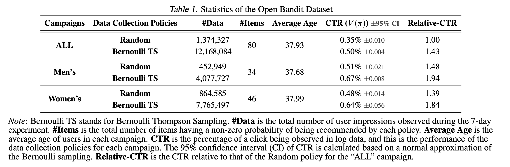
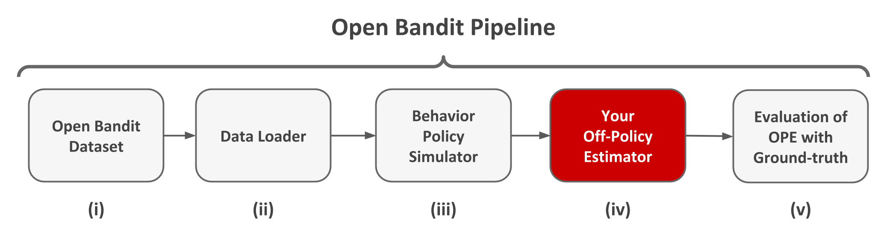

===============
About
===============
Motivated by the paucity of real-world data and implementation enabling the evaluation and comparison of OPE, we release the following open-source dataset and pipeline software for research uses.

Open Bandit Dataset (OBD)
------------------------------

*Open Bandit Dataset* is a public real-world logged bandit feedback data.
The dataset is provided by `ZOZO, Inc. <https://corp.zozo.com/en/about/profile/>`_, the largest Japanese fashion e-commerce company with over 5 billion USD market capitalization (as of May 2020).
The company uses multi-armed bandit algorithms to recommend fashion items to users in a large-scale fashion e-commerce platform called `ZOZOTOWN <https://zozo.jp/>`_.
The following figure presents examples of displayed fashion items as actions.

.. image:: ./_static/images/recommended_fashion_items.png
   :scale: 25%
   :align: center

We collected the data in a 7-days experiment in late November 2019 on three campaigns, corresponding to "all", "men's", and "women's" items, respectively.
Each campaign randomly uses either the Random policy or the Bernoulli Thompson Sampling (Bernoulli TS) policy for each user impression.
Note that we pre-trained Bernoulli TS for over a month before the data collection process and the policy well converges to a fixed one.
Thus, we suppose our data is generated by a fixed policy and apply the standard OPE formulation that assumes static behavior and evaluation policies.
These policies select three of the possible fashion items to each user.
Let :math:`\mathcal{I}:=\{0,\ldots,n\}` be a set of :math:`n+1` items and :math:`\mathcal{K}:=\{0,\ldots,k\}` be a set of :math:`k+1` positions.
The above figure shows that :math:`k+1=3` for our data.
We assume that the reward (click indicator) depends only on the item and its position, which is a general assumption on the click generative model in the web industry:cite:`Li2018`.
Under the assumption, the action space is simply the product of the item set and the position set, i.e., :math:`\calA = \mathcal{I} \times \mathcal{K}`.
Then, we can apply the standard OPE setup and estimators to our setting.
We describe some statistics of the dataset in the following.

The data is large and contains many millions of recommendation instances.
It also includes the true action choice probabilities by behavior policies computed by Monte Carlo simulations based on the policy parameters (e.g., parameters of the beta distribution used by Bernoulli TS) used during the data collection process.
The number of actions is also sizable, so this setting is challenging for bandit algorithms and their OPE.
We share the full version of our data at https://research.zozo.com/data.html

Open Bandit Pipeline (OBP)
---------------------------------

*Open Bandit Pipeline* is a series of implementations of dataset preprocessing, policy learning, and evaluation of OPE estimators.
This pipeline allows researchers to focus on building their bandit algorithm or OPE estimator and easily compare them with others’ methods in realistic and reproducible ways.
Thus, it facilitates reproducible research on bandit algorithms and off-policy evaluation.

Open Bandit Pipeline consists of the following main modules.

- **dataset module**: This module provides a data loader for Open Bandit Dataset and a flexible interface for handling logged bandit feedback. It also provides tools to generate synthetic bandit datasets.
- **policy module**: This module provides interfaces for online and offline bandit algorithms. It also implements several standard algorithms.
- **simulator module**: This module provides functions for conducting offline bandit simulation.
- **ope module**: This module provides interfaces for OPE estimators. It also implements several standard OPE estimators.

In addition to the above algorithms and estimators, the pipeline also provides flexible interfaces.
Therefore, researchers can easily implement their own algorithms or estimators and evaluate them with our data and pipeline.
Moreover, the pipeline provides an interface for handling logged bandit feedback datasets.
Thus, practitioners can combine their own datasets with the pipeline and easily evaluate bandit algorithms' performances in their settings.

Please see `package reference <https://zr-obp.readthedocs.io/en/latest/obp.html>`_ for detailed information about Open Bandit Pipeline.

To our knowledge, our real-world dataset and pipeline are the first to include logged bandit datasets collected by running *multiple* different policies, policy implementations used in production, and their ground-truth policy values.
These features enable the **evaluation of OPE** for the first time.
