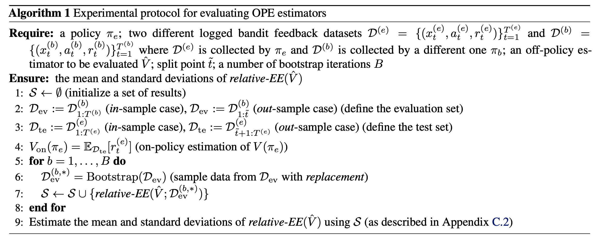

================================================
Evaluation of OPE
================================================
Here we describe an experimental protocol to evaluate OPE estimators and use it to compare a wide variety of existing estimators.

We can empirically evaluate OPE estimators' performances by using two sources of logged bandit feedback collected by two different policies :math:`\pi^{(he)}` (hypothetical evaluation policy) and :math:`\pi^{(hb)}` (hypothetical behavior policy).
We denote log data generated by :math:`\pi^{(he)}` and :math:`\pi^{(hb)}` as :math:`\calD^{(he)} := \{ (x^{(he)}_t, a^{(he)}_t, r^{(he)}_t) \}_{t=1}^T` and :math:`\calD^{(hb)} := \{ (x^{(hb)}_t, a^{(hb)}_t, r^{(hb)}_t) \}_{t=1}^T`, respectively.
By applying the following protocol to several different OPE estimators, we can compare their estimation performances:

1. Define the evaluation and test sets as:

    * in-sample case: :math:`\calD_{\mathrm{ev}} := \calD^{(hb)}_{1:T}`, :math:`\calD_{\mathrm{te}} := \calD^{(he)}_{1:T}`
    * out-sample case: :math:`\calD_{\mathrm{ev}} := \calD^{(hb)}_{1:\tilde{t}}`, :math:`\calD_{\mathrm{te}} := \calD^{(he)}_{\tilde{t}+1:T}`

    where :math:`\calD_{a:b} := \{ (x_t,a_t,r_t) \}_{t=a}^{b}`.

2. Estimate the policy value of :math:`\pi^{(he)}` using :math:`\calD_{\mathrm{ev}}` by an estimator :math:`\hat{V}`. We can represent an estimated policy value by :math:`\hat{V}` as :math:`\hat{V} (\pi^{(he)}; \calD_{\mathrm{ev}})`.

3. Estimate :math:`V(\pi^{(he)})` by the *on-policy estimation* and regard it as the ground-truth as

    .. math::
        V_{\mathrm{on}} (\pi^{(he)}; \calD_{\mathrm{te}}) := \E_{\calD_{\mathrm{te}}} [r^{(he)}_t].

4. Compare the off-policy estimate :math:`\hat{V}(\pi^{(he)}; \calD_{\mathrm{ev}})` with its ground-truth :math:`V_{\mathrm{on}} (\pi^{(he)}; \calD_{\mathrm{te}})`. We can evaluate the estimation accuracy of :math:`\hat{V}` by the following *relative estimation error* (relative-EE):

    .. math::
        \textit{relative-EE} (\hat{V}; \calD_{\mathrm{ev}}) := \left| \frac{\hat{V} (\pi^{(he)}; \calD_{\mathrm{ev}}) - V_{\mathrm{on}} (\pi^{(he)}; \calD_{\mathrm{te}}) }{V_{\mathrm{on}} (\pi^{(he)}; \calD_{\mathrm{te}})} \right|.

5. To estimate standard deviation of relative-EE, repeat the above process several times with different bootstrap samples of the logged bandit data created by sampling data *with replacement* from :math:`\calD_{\mathrm{ev}}`.

We call the problem setting **without** the sample splitting by time series as in-sample case.
In contrast, we call that **with** the sample splitting as out-sample case where OPE estimators aim to estimate the policy value of an evaluation policy in the test data.

The following algorithm describes the detailed experimental protocol to evaluate OPE estimators.

Using the above protocol, our real-world data, and pipeline, we have performed extensive benchmark experiments on a variety of existing off-policy estimators.
The experimental results and the relevant discussion can be found in `our paper <https://arxiv.org/abs/2008.07146>`_.
The code for running the benchmark experiments can be found at `zr-obp/benchmark/ope <https://github.com/st-tech/zr-obp/tree/master/benchmark>`_.
