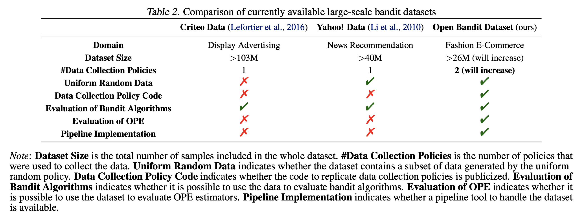
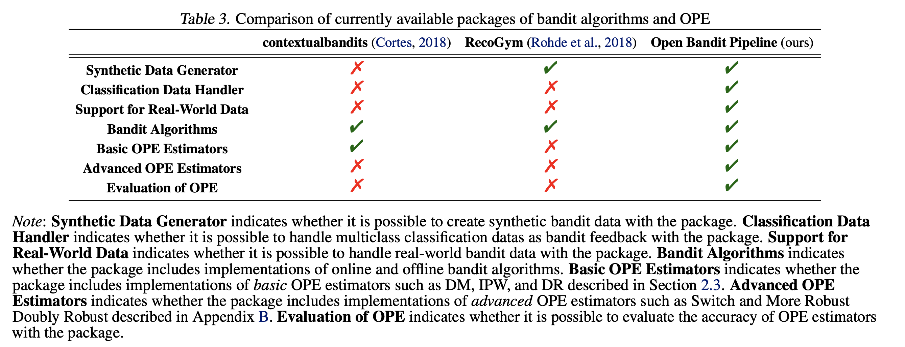

===================
Related Resources
===================
We summarize existing related resources for bandit algorithms and off-policy evaluation.

Related Datasets
--------------------
Our dataset is most closely related to those of :cite:`Lefortier2016` and :cite:`Li2010`.
:cite:`Lefortier2016` introduces a large-scale logged bandit feedback data (Criteo data) from a leading company in the display advertising, Criteo.
The data contains context vectors of user impressions, advertisements (ads) as actions, and click indicators as reward.
It also provides the ex ante probability of each ad being selected by the behavior policy.
Therefore, this data can be used to compare different *off-policy learning* methods, which aim to learn a new bandit policy using only log data generated by a behavior policy.
In contrast, :cite:`Li2010` introduces a dataset (Yahoo! data) collected on a news recommendation interface of the the Yahoo! Today Module.
The data contains context vectors of user impressions, presented news as actions, and click indicators as reward.
It was collected by running uniform random policy on the new recommendation platform, allowing researchers to evaluate their own bandit algorithms.

However, the Criteo and Yahoo! data have limitations, which we overcome as follows:

* The previous datasets do not provide the code (production implementation) of their behavior policy. Moreover, the data was collected by running only a single behavior policy. As a result, these data cannot be used for the evaluation and comparison of different OPE estimators.

:math:`\rightarrow` In contrast, we provide the code of our behavior policies (i.e., Bernoulli TS and Random) in our pipeline, which allows researchers to re-run the same behavior policies on the log data. Our open data also contains logged bandit feedback data generated by *multiple* behavior policies.  It enables the evaluation and comparison of different OPE estimators. This is the first large-scale bandit dataset that enables such evaluation of OPE with the ground-truth policy value of behavior policies.

* The previous datasets do not provide a pipeline implementation to handle their data. Researchers have to re-implement the experimental environment by themselves before implementing their own methods. This may lead to inconsistent experimental conditions across different studies, potentially causing reproducibility issues.

:math:`\rightarrow` We implement the Open Bandit Pipeline to simplify and standardize the experimental processing of bandit algorithms and OPE with our open data. This tool thus contributes to the reproducible and transparent use of our data.

The following table summarizes key differences between our data and existing ones.

Related Packages
-------------------
There are several existing Python packages related to our Open Bandit Pipeline.
For example, *contextualbandits* package (https://github.com/david-cortes/contextualbandits) contains implementations of several contextual bandit algorithms :cite:`Cortes2018`.
It aims to provide an easy procedure to compare bandit algorithms to reproduce research papers that do not provide easily-available implementations.
In addition, *RecoGym* (https://github.com/criteo-research/reco-gym) focuses on providing simulation bandit environments imitating the e-commerce recommendation setting :cite:`Rohde2018`.
This package also implements an online bandit algorithm based on epsilon greedy and off-policy learning method based on IPW.

However, the following features differentiate our pipeline from the previous ones:

* The previous packages focus on implementing and comparing online bandit algorithms or off-policy learning method. Instead, they **cannot** be used to implement and compare the off-policy evaluation methods.

:math:`\rightarrow` Our package implements a wide variety of OPE estimators including advanced ones such as Switch Estimators :cite:`Wang2016`, More Robust Doubly Robust :cite:`Farajtabar2018`, and Doubly Robust with Shrinkage :cite:`Su2019`. Moreover, it is possible to compare the estimation accuracies of these estimators with our package in a fair manner. Our package also provides flexible interfaces for implementing new OPE estimators. Thus, researchers can easily compare their own estimators with other methods using our packages.

* The previous packages cannot handle real-world bandit datasets.

:math:`\rightarrow` Our package comes with the Open Bandit Dataset and includes the **dataset module**. This enables the evaluation of bandit algorithms and off-policy estimators using our real-world data. This function contributes to realistic experiments on these topics.

The following table summarizes key differences between our pipeline and existing ones.

