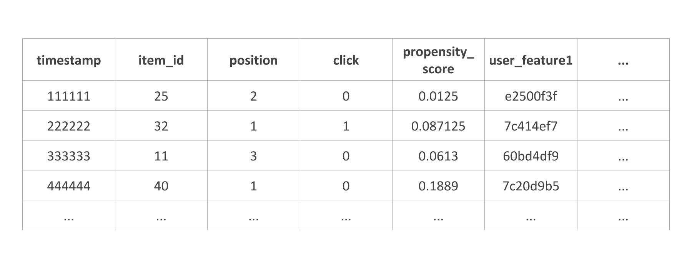

# Open Bandit Dataset

このディレクトリには, [実装例](https://github.com/st-tech/zr-obp/tree/master/examples)を実行するための少量(キャンペーンと行動ポリシーのペアごとに10,000レコード)のデータが含まれています. フルサイズ版のデータは[https://research.zozo.com/data.html](https://research.zozo.com/data.html)にて公開されています.

この公開データセットに関する詳細な記述は以下の論文を参照してください:

Yuta Saito, Shunsuke Aihara, Megumi Matsutani, Yusuke Narita.  
**Large-scale Open Dataset, Pipeline, and Benchmark for Bandit Algorithms**  
[https://arxiv.org/abs/2008.07146](https://arxiv.org/abs/2008.07146)

## データセットの概要
Open Bandit Datasetは, 大規模ファッションECサイト[ZOZOTOWN](https://zozo.jp/)において, 2つの多腕バンディット方策のA/Bテストによって構築されたものです. 現在のログデータ数は合計2600万以上であり, それぞれのデータは特徴量・方策によって選択されたファッションアイテム・真の傾向スコア・クリック有無ラベルによって構成されます. このデータセットは, 別のアルゴリズムによって生成されたデータを用いて反実仮想アルゴリズムの性能を予測するオフ方策評価 (off-policy evaluation)の性能を評価するのに特に適しています.

## 構成
データセットの構成要素の詳細は以下の通りです.

**{behavior_policy}/{campaign}.csv** (behavior_policy in (bts, random), campaign in (all, men, women))
- timestamp: インプレッションのタイムスタンプ.
- item_id: アイテムのインデックス（インデックスの範囲は「すべて」キャンペーンでは0～80, 「男性」キャンペーンでは0～33, 「女性」キャンペーンでは0～46）.
- position: 推薦されるアイテムの位置(1, 2, 3はそれぞれ[ZOZOTOWNの推薦インターフェース](../images/recommended_fashion_items.png)の左, 中央, 右の位置に対応)
- click: アイテムがクリックされたか（1）, されなかったか（0）を示す2値目的変数.
- action_prob：与えられたpositionにアイテムが推薦された際に計算した推薦確率. 傾向スコア.
- user_features：ユーザーに関連する特徴量. 匿名化の目的でハッシュ化されている.
- user_item_affinity: それぞれのユーザとアイテムのペア間で観測された過去のクリック数に応じた関連度特徴量

**item_context.csv** **item_context.csv** **item_context.csv**
- item_id：アイテムのインデックス（インデックスの範囲は, 「すべて」キャンペーンでは0～79, 「男性」キャンペーンでは0～33, 「女性」キャンペーンでは0～45）.
- item feature 0-3：アイテムに関連するの特徴量.

  
  <figcaption>
  

    Open Bandit Datasetの構成
  

  </figcaption>

なお, user featureとitem featureのそれぞれが何を表すかについては、現在公表されておりません.
また, それぞれのfeatureの値は, ハッシュ関数を用いて匿名化されています.

## 連絡
データセットに関する質問等は, 次のメールアドレスにご連絡いただくようお願いいたします:

- 論文の著者: saito@hanjuku-kaso.com
- ZOZO研究所: zozo-research@zozo.com
